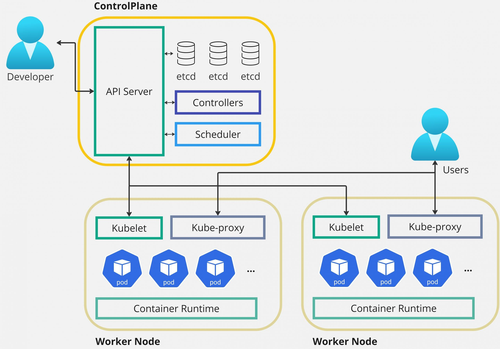

## 🔥 쿠버네티스 기초
## ✨ Kubernetes란?
>👉 컨테이너를 자동으로 배포 / 관리 / 확장해주는 시스템



### 전체 구조
##### Control Plane (두뇌)
- 클러스터를 "관리"하는 영역

##### Node (몸)
- 실제 컨테이너(Pod)가 돌아가는 서버

#### 🧠 Control Plane 핵심 컴포넌트
##### ✔ kube-apiserver
- 모든 요청의 입구 (REST API)
- kubectl도 여기로 요청 보냄
👉 "쿠버네티스의 관문"

##### ✔ etcd
클러스터 상태 저장 (DB)
모든 설정, 상태가 여기에 있음
👉 "쿠버네티스의 DB"

##### ✔ scheduler
Pod를 어느 Node에 배치할지 결정
👉 "어디에 배치할까?"

##### ✔ controller-manager
상태를 맞춰주는 역할
(예: Pod 죽으면 다시 생성)
👉 "원하는 상태 유지"
___
#### 🖥 Node 구성
##### ✔ kubelet
- Node에서 Pod 관리
- Control Plane 지시 수행

👉 "현장 관리자"

##### ✔ kube-proxy
- 네트워크 연결 담당

👉 "트래픽 연결"

##### ✔ Container Runtime
- Docker 같은 것

👉 "실제로 컨테이너 실행"
___

#### 📦 Pod (개념 미리 맛보기)
👉 Kubernetes 최소 실행 단위
- 컨테이너 1개 이상 포함
- 같은 네트워크 / 볼륨 공유
___

#### 📄 YAML (엄청 중요)
- 쿠버네티스는 전부 YAML로 정의함
ex)
```yaml
apiVersion: v1
kind: Pod
metadata:
  name: my-pod
spec:
  containers:
  - name: nginx
    image: nginx
```
___
#### 🔥 핵심 흐름
```
kubectl apply -f pod.yaml
   ↓
kube-apiserver 요청 받음
   ↓
etcd 저장
   ↓
scheduler가 node 선택
   ↓
kubelet이 pod 실행
```
___
## 📖 용어
#### 🟢 1. Pod (가장 중요)
>👉 컨테이너 실행 최소 단위

Pod = 컨테이너 1개 (보통) 또는 여러 개 묶음
Docker 컨테이너를 감싸는 개념
k8s는 컨테이너를 직접 다루지 않고 Pod로 다룸

👉 핵심:
“컨테이너 = Pod 안에 있음”

#### 🔵 2. Node
>👉 Pod가 실행되는 서버

Node = 실제 머신 (VM / 물리 서버)
k3d에서는 Docker 컨테이너가 Node 역할

#### 🟣 3. Cluster
>👉 Node들의 집합

Cluster = 여러 Node 묶음
쿠버네티스 전체 환경

#### 🟡 4. Deployment ⭐
>👉 Pod를 자동으로 관리하는 놈

Deployment = Pod 생성 + 유지 + 재시작
Pod 죽으면 자동으로 다시 생성
개수 유지 (Replica)

👉 실무에서는 Pod 직접 안 만들고 Deployment 씀

#### 🟠 5. ReplicaSet
>👉 Pod 개수 유지 담당

ReplicaSet = Pod 개수 맞춰주는 역할
Deployment 내부에서 사용됨
직접 쓸 일 거의 없음

#### 🔴 6. Service ⭐
>👉 Pod 접근을 위한 통로

Service = Pod에 접근하는 고정 주소
문제: Pod는 IP가 계속 바뀜
해결: Service로 고정된 endpoint 제공

#### ⚫ 7. Ingress
>👉 외부 → 내부 서비스 연결
Ingress = 외부 요청 라우팅 (URL 기반)

예:
/api → A 서비스
/login → B 서비스

#### 🟤 8. ConfigMap
>👉 설정값 관리

ConfigMap = 환경 설정 (DB URL 등)

#### ⚪ 9. Secret
>👉 민감 정보 저장

Secret = 비밀번호, 토큰
🧠 구조 한방 정리
```
Cluster
 └─ Node
     └─ Pod
         └─ Container

Deployment → Pod 관리
Service → Pod 연결
Ingress → 외부 연결
```

___
#### 🔴 동작 과정 정리
```
사용자가 웹 접속
   ↓
Ingress
   ↓
Service
   ↓
Deployment
   ↓
Pod (컨테이너) 
```