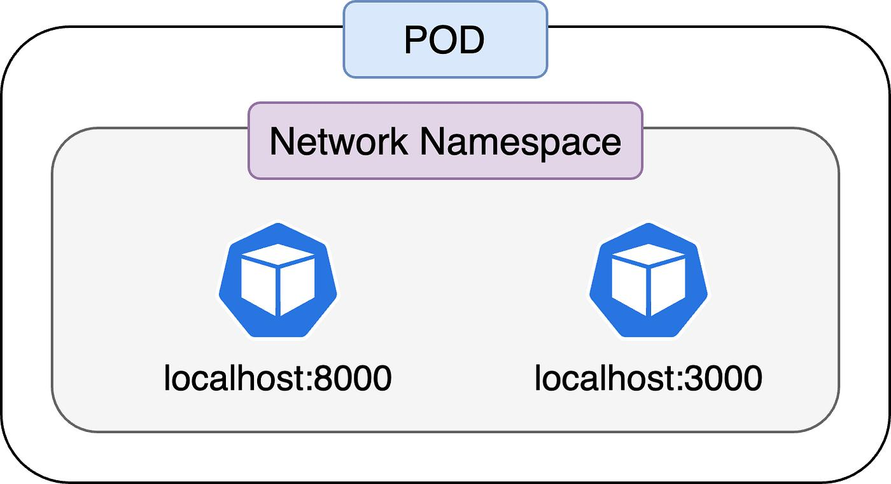

## 🔥 Pod
#### 📦 Pod 한 줄 정의
👉 컨테이너를 감싸는 최소 실행 단위

- Docker는 컨테이너 단위
- Kubernetes는 Pod 단위
___

👉 핵심 특징
- 같은 Pod 안 컨테이너들은
  - **같은 IP 사용**
  - **localhost로 통신 가능**
- Volume 공유 가능
___
#### ✨ Pod에서 가장 중요한 개념 3개
##### 1️⃣ Pod = 1 IP
👉 컨테이너마다 IP 아님
##### 2️⃣ 컨테이너끼리 localhost 통신
```
nginx → localhost:8080 (같은 Pod)
```
##### 3️⃣ Pod는 잘 안 직접 씀
👉 보통 Deployment로 관리함
___
### 🧪 실습 1: Pod 생성 (명령어 방식)
```bash
kubectl run nginx-pod --image=nginx
kubectl get pods #생성한 pod 확인
```
### 🧪 실습 2: Pod 내부 들어가기
```bash
kubectl exec -it nginx-pod -- bash
kubectl exec -it nginx-pod -- sh # bash로 안되는 경우
```
### 🧪 실습 3: 로그 보기
```bash
kubectl logs nginx-pod
```
___
#### 💣 주의할 점
##### ❌ 컨테이너 = Pod 라고 생각
👉 완전 틀림

##### ❌ Pod 재시작 개념
👉 Pod는 재시작이 아니라 재생성

##### ❌ Pod 직접 운영
👉 실무에서는 거의 안씀 (Deployment 사용)